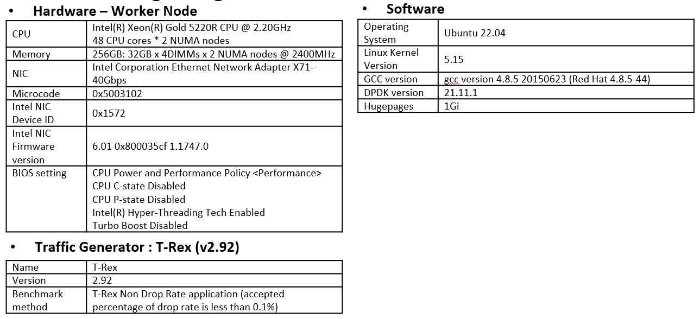

## Testbed Topology


## Benchmarking Configuration


## Software Prerequisites for Master Nodes, and Worker Nodes

```
Step 1: Installing env packages for CentOS
	sudo yum install epel-release
	sudo yum install python-pip
	pip --version

Step 2: Installing Ansible by "virtual environments"
	pip install --upgrade pip
	pip install virtualenv
	
	pip uninstall ansible
	python -m virtualenv ansible
	source ansible/bin/activate 
	python -m pip install ansible==2.9.14
```


```
sudo yum install sshpass
sudo yum install libselinux-python
#sudo yum install libselinux-python3
pip install selinux
cp -r /usr/lib64/python2.7/site-packages/selinux $VIRTUAL_ENV/lib/python2.7/site-packages

ssh-key-gen
ssh-copy-id worker@192.168.26.41

cd /root/k8s_ansible
ansible-playbook installation_k8s.yml
ansible-playbook settingup_k8s_cluster.yml
```


