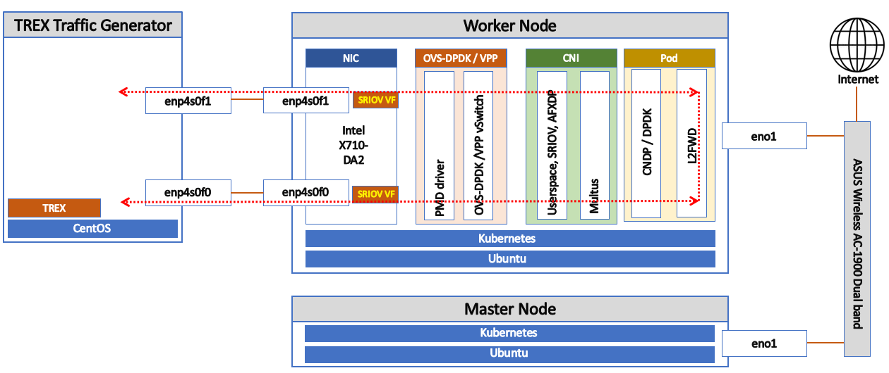

## Testbed Topology

## Benchmarking Configuration

|     Node name     | Specification                                                | Description                                                  |
| :---------------: | :----------------------------------------------------------- | :----------------------------------------------------------- |
|    Worker node hardware   | - CPU : Intel(R) Xeon(R) Gold 5220R CPU @ 2.20GHz; 80 cores  - MEM : 256GB - DISK : 2TB - NIC : XL710 for 40GbE | 
|    Worker node software  | - OS : Ubuntu 22.04 (18.04 for VPP test)  - DPDK : v22.11.1  - OVS: v3.1.90 (DPDK, AFXDP enabled) - VPP : v19.04  - Docker : v20.10.22  - Kubernetes : v1.23.5  - K8s CNI : Flannel, Multus, Userspace, SRIOV, AFXDP | 
| Traffic Generator | - Software : T-Rex v2.92, v2.73  - Benchmarking method : T-Rex Non Drop Rate (ndr) | 

